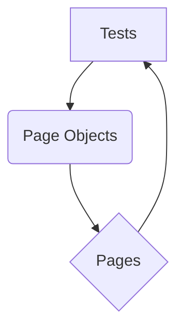

# Playwright MPC Tests

This project contains Playwright tests for the NAPLAN public demonstration site.

## Installation

1. **Clone the repository:**
   ```bash
   git clone https://github.com/gemini-cli-automation/playwright-mpc-tests.git
   ```

2. **Create a virtual environment:**
   ```bash
   python -m venv venv
   ```

3. **Activate the virtual environment:**
   - **Windows:**
     ```bash
     venv\Scripts\activate
     ```
   - **macOS/Linux:**
     ```bash
     source venv/bin/activate
     ```

4. **Install the dependencies:**
   ```bash
   pip install -r requirements.txt
   ```

## Running the tests

To run all the tests, use the following command:

```bash
pytest
```

### Running UI tests

To run the UI tests, use the following command:

```bash
pytest tests/
```

To run the UI tests in headed mode, use the following command:

```bash
pytest tests/ --headed
```

### Running API tests

To run the API tests, use the following command:

```bash
pytest API/tests/
```

### Running Mock API generator tests

To run the Mock API generator tests, use the following command:

```bash
pytest MOCK_GEN/tests/
```

### Running Security and Penetration Tests

These tests are designed to identify potential security vulnerabilities in the API.

To run the security and penetration tests, use the following command:

```bash
pytest API/tests/test_security.py
```

**Note on FakeStoreAPI Behavior:**

The `https://fakestoreapi.com/products` API, used for these tests, exhibits some unconventional behavior for certain negative scenarios (e.g., returning `200 OK` for non-existent resources or accepting invalid input). The assertions in `API/tests/test_security.py` have been adjusted to reflect these actual responses, effectively highlighting these behaviors as potential vulnerabilities or unexpected API design choices.

### Running Performance Tests

Performance tests are built using [Locust](https://locust.io/). They simulate user load on the API endpoints to measure performance metrics.

To run the performance tests:

1.  Navigate to the `perf/tests` directory:
    ```bash
    cd perf/tests
    ```

2.  Run Locust:
    ```bash
    locust -f locustfile.py --host https://fakestoreapi.com
    ```

3.  Open your web browser and go to `http://localhost:8089` to access the Locust web UI. From there, you can start the test by specifying the number of users and the spawn rate.

## Test Design

The tests are designed using the Page Object Model (POM) architecture. This architecture separates the test code from the page-specific code, making the tests more readable, maintainable, and reusable.

### Flow Diagram



### Explanation

- **Tests:** The tests are written in Python using the `pytest` framework and the `playwright` library. They are responsible for the test logic and assertions.
- **Page Objects:** Each page in the application has its own page object file. The page object contains the locators for the elements on the page and the methods to interact with them.
- **Pages:** The pages are the actual web pages of the application under test.

The tests use the page objects to interact with the pages and assert the expected behavior. This separation of concerns makes the tests more robust and easier to maintain.

## API Tests

The API tests are written using the `requests` library. They send requests to the API endpoints and assert the responses.

## Mock API Generator

The Mock API generator is a simple tool that can be used to generate mock APIs for testing purposes. It can generate mock responses for GET, POST, PUT, and DELETE requests.
