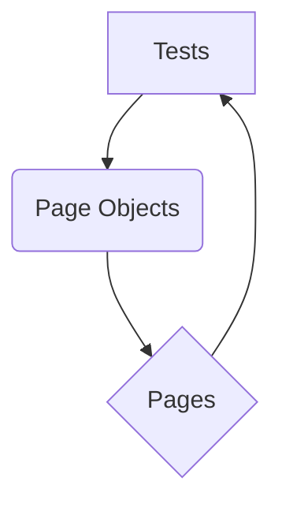

# Playwright MPC Tests

This project contains Playwright tests for the NAPLAN public demonstration site, along with various API and performance tests.

## Table of Contents

*   [Installation](#installation)
*   [Running Tests](#running-tests)
    *   [Running All Tests](#running-all-tests)
    *   [Running UI Tests](#running-ui-tests)
    *   [Running API Tests](#running-api-tests)
    *   [Running Mock API Generator Tests](#running-mock-api-generator-tests)
    *   [Running Security and Penetration Tests](#running-security-and-penetration-tests)
    *   [Running Performance Tests](#running-performance-tests)
    *   [Running Visual Regression Tests](#running-visual-regression-tests)
*   [Test Design](#test-design)
    *   [Flow Diagram](#flow-diagram)
    *   [Explanation](#explanation)
*   [UI Tests](#ui-tests)
*   [API Tests](#api-tests)
*   [Mock API Generator](#mock-api-generator)
*   [Security and Penetration Tests](#security-and-penetration-tests)
*   [Performance Tests](#performance-tests)
*   [Visual Regression Testing with Applitools](#visual-regression-testing-with-applitools)
    *   [Visual Regression Testing Design](#visual-regression-testing-design)

## Installation

1.  **Clone the repository:**
    ```bash
    git clone https://github.com/gemini-cli-automation/playwright-mpc-tests.git
    ```

2.  **Create a virtual environment:**
    ```bash
    python -m venv venv
    ```

3.  **Activate the virtual environment:**
    -   **Windows:
        ```bash
        venv\Scripts\activate
        ```
    -   **macOS/Linux:**
        ```bash
        source venv/bin/activate
        ```

4.  **Install the dependencies:**
    ```bash
    pip install -r requirements.txt
    ```

## Running Tests

### Running All Tests

To run all the tests (UI, API, Mock API Generator, Security, and Performance), use the following command:

```bash
pytest
```

### Running UI Tests

UI tests interact with the web application through a browser to simulate user behavior. They verify the functionality and appearance of the user interface.

To run the UI tests, use the following command:

```bash
pytest tests/
```

To run the UI tests in headed mode (with a visible browser window), use the following command:

```bash
pytest tests/ --headed
```

### Running API Tests

API tests verify the functionality, reliability, performance, and security of the API endpoints. They directly interact with the API without a user interface.

To run the API tests, use the following command:

```bash
pytest API/tests/
```

### Running Mock API Generator Tests

These tests ensure the functionality of the Mock API Generator, which is used to simulate API responses for testing purposes.

To run the Mock API generator tests, use the following command:

```bash
pytest MOCK_GEN/tests/
```

### Running Security and Penetration Tests

Security and penetration tests are a crucial part of the testing suite, designed to uncover vulnerabilities that could be exploited by malicious actors. These tests specifically target common API security flaws, based on industry best practices like the OWASP API Security Top 10.

### Security-and-penetration-tests

**Types of Vulnerabilities Targeted:**

*   **Injection Flaws (API1:2023):** These tests attempt to inject malicious code (e.g., SQL commands, Cross-Site Scripting (XSS) payloads) into API parameters or request bodies. The goal is to see if the application improperly processes this input, potentially leading to data breaches, unauthorized access, or execution of arbitrary code.
    *   **Example:** Injecting `<script>alert('XSS')</script>` into a product title to check for XSS reflection.
*   **Broken Object Property Level Authorization (BOPLA) / Mass Assignment (API3:2023):** This vulnerability occurs when an API allows a user to modify properties of an object that they should not have access to. Tests simulate attempts to create or update resources with unexpected or unauthorized fields (e.g., trying to set an `isAdmin` flag to `true` when creating a user).
    *   **Example:** Sending a product creation request with an `isAdmin: true` field to see if the API processes it.
*   **Unrestricted Resource Consumption (API4:2023):** These tests assess the API's resilience to resource exhaustion attacks. This includes sending:
    *   **Large Payloads:** Very large JSON payloads in requests to see if the API can handle them efficiently without crashing or timing out.
    *   **High Request Volumes:** Rapidly sending a large number of requests to check for rate limiting mechanisms and denial-of-service vulnerabilities.
*   **Improper Error Handling (API7:2023):** Poorly implemented error handling can leak sensitive information (e.g., stack traces, internal server details, database schemas) to attackers. Tests check if error messages reveal too much information when invalid requests are made.
    *   **Example:** Sending malformed JSON or using unsupported HTTP methods to trigger errors and inspect the response for sensitive data.
*   **Server-Side Request Forgery (SSRF) (API6:2023):** SSRF vulnerabilities allow an attacker to induce the server-side application to make HTTP requests to an arbitrary domain of the attacker's choosing. Tests simulate providing internal IP addresses or local file paths in URL parameters (e.g., image URLs) to see if the server attempts to access these internal resources.
    *   **Example:** Providing `http://localhost/admin` as an image URL to see if the server tries to connect to its own admin interface.
*   **Input Fuzzing:** This involves sending a wide range of unexpected, malformed, or random data to API endpoints to discover vulnerabilities that might not be apparent through standard testing. This can uncover issues like buffer overflows, crashes, or unexpected behavior.
    *   **Example:** Sending extremely long strings to text fields to see how the API handles them.

The tests in `API/tests/test_security.py` are designed to simulate these scenarios and report on the API's behavior.

**Note on FakeStoreAPI Behavior:**

The `https://fakestoreapi.com/products` API, used for these tests, exhibits some unconventional behavior for certain negative scenarios (e.g., returning `200 OK` for non-existent resources or accepting invalid input). The assertions in `API/tests/test_security.py` have been adjusted to reflect these actual responses, effectively highlighting these behaviors as potential vulnerabilities or unexpected API design choices. For instance, a test might "pass" if an XSS payload is reflected, indicating a successful identification of a vulnerability rather than a functional pass.

### Running Performance Tests

Performance tests are built using [Locust](https://locust.io/). They simulate user load on the API endpoints to measure performance metrics such as response time, throughput, and error rates under various load conditions.

To run the performance tests:

1.  Navigate to the `perf/tests` directory:
    ```bash
    cd perf/tests
    ```

2.  Run Locust:
    ```bash
    locust -f locustfile.py --host https://fakestoreapi.com
    ```

3.  Open your web browser and go to `http://localhost:8089` to access the Locust web UI. From there, you can start the test by specifying the number of users and the spawn rate.

### Running Visual Regression Tests

Visual regression tests use Applitools to capture and compare screenshots of the application's UI to detect any unexpected visual changes. To run these tests, you need to have an Applitools account and an API key.

1.  **Set the Applitools API Key:**

    You can set your Applitools API key as an environment variable:

    ```bash
    export APPLITOOLS_API_KEY="YOUR_APPLITOOLS_API_KEY"
    ```

    Alternatively, you can create a file named `applitools.key` in the root directory of the project and add your API key to it.

2.  **Run the tests:**

    ```bash
    pytest tests/
    ```

## Test Design

The tests are designed using the Page Object Model (POM) architecture. This architecture separates the test code from the page-specific code, making the tests more readable, maintainable, and reusable.

### Flow Diagram



### Explanation

-   **Tests:** The tests are written in Python using the `pytest` framework and the `playwright` library (for UI tests) or `requests` library (for API tests). They are responsible for the test logic, assertions, and orchestrating interactions with the application.
-   **Page Objects:** Each significant page or component in the application has its own page object file. A page object encapsulates the elements (locators) on that page and the actions (methods) that can be performed on them. This abstraction makes tests less brittle to UI changes.
-   **Pages:** The pages are the actual web pages or API endpoints of the application under test.

The tests use the page objects to interact with the pages and assert the expected behavior. This separation of concerns makes the tests more robust and easier to maintain.

## UI Tests

UI tests verify the visual and functional aspects of the web application. They ensure that elements are correctly displayed, user interactions work as expected, and navigation flows are smooth. These tests use Playwright to automate browser interactions.

## API Tests

API tests focus on the backend services of the application. They directly send requests to API endpoints and validate the responses, ensuring that the data is correctly processed, and the API behaves as expected under various conditions (e.g., valid input, invalid input, missing data). These tests use the `requests` library for HTTP communication and `jsonschema` for response validation.

## Mock API Generator

The Mock API generator is a simple tool that can be used to generate mock APIs for testing purposes. It allows developers and testers to simulate API responses, enabling frontend and backend development to proceed in parallel without waiting for actual API implementations. It can generate mock responses for GET, POST, PUT, and DELETE requests.

## Visual Regression Testing with Applitools

This project uses Applitools for visual regression testing. Applitools captures screenshots of the application and compares them to baseline images to identify any unintended visual changes. This helps to prevent layout bugs and ensure a consistent user experience.

To use Applitools, you need to have an account and an API key. You can get a free account on the [Applitools website](https://applitools.com/).

Once you have an API key, you can set it as an environment variable or create a file named `applitools.key` in the root directory of the project and add your API key to it. The tests will then automatically capture screenshots and send them to the Applitools dashboard for comparison.

### Visual Regression Testing Design

*   **Base Page:** The `VisualBasePage` class in `tests/visual/visual_base_page.py` is the base class for all visual tests. It contains the basic setup for Applitools, such as initializing the Eyes object and opening a new test session.
*   **Test Fixture:** The `visual_page` fixture in `tests/test_home_page.py` is a pytest fixture that initializes the `VisualBasePage` and opens a new test session. It is used in each test function to take a screenshot of the page.
*   **Test Functions:** The test functions in `tests/test_home_page.py` use the `visual_page` fixture to take a screenshot of the page. The `eyes.check` method is used to take a screenshot of the current page and send it to the Applitools dashboard for comparison.
*   **Applitools Dashboard:** The Applitools dashboard is used to review the visual differences between the baseline and the current screenshots. If the differences are expected, you can accept the new screenshots as the baseline. This will update the baseline images and resolve the `DiffsFoundError`.