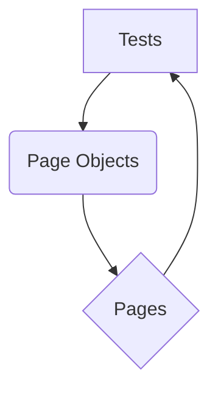

# Playwright MPC Tests

This project contains Playwright tests for the NAPLAN public demonstration site, along with various API and performance tests.

## Table of Contents

*   [Installation](#installation)
*   [Running Tests](#running-tests)
    *   [Running All Tests](#running-all-tests)
    *   [Running UI Tests](#running-ui-tests)
    *   [Running API Tests](#running-api-tests)
    *   [Running Mock API Generator Tests](#running-mock-api-generator-tests)
    *   [Running Security and Penetration Tests](#running-security-and-penetration-tests)
    *   [Running Performance Tests](#running-performance-tests)
*   [Test Design](#test-design)
    *   [Flow Diagram](#flow-diagram)
    *   [Explanation](#explanation)
*   [UI Tests](#ui-tests)
*   [API Tests](#api-tests)
*   [Mock API Generator](#mock-api-generator)
*   [Security and Penetration Tests](#security-and-penetration-tests)
*   [Performance Tests](#performance-tests)

## Installation

1.  **Clone the repository:**
    ```bash
    git clone https://github.com/gemini-cli-automation/playwright-mpc-tests.git
    ```

2.  **Create a virtual environment:**
    ```bash
    python -m venv venv
    ```

3.  **Activate the virtual environment:**
    -   **Windows:**
        ```bash
        venv\Scripts\activate
        ```
    -   **macOS/Linux:**
        ```bash
        source venv/bin/activate
        ```

4.  **Install the dependencies:**
    ```bash
    pip install -r requirements.txt
    ```

## Running Tests

### Running All Tests

To run all the tests (UI, API, Mock API Generator, Security, and Performance), use the following command:

```bash
pytest
```

### Running UI Tests

UI tests interact with the web application through a browser to simulate user behavior. They verify the functionality and appearance of the user interface.

To run the UI tests, use the following command:

```bash
pytest tests/
```

To run the UI tests in headed mode (with a visible browser window), use the following command:

```bash
pytest tests/ --headed
```

### Running API Tests

API tests verify the functionality, reliability, performance, and security of the API endpoints. They directly interact with the API without a user interface.

To run the API tests, use the following command:

```bash
pytest API/tests/
```

### Running Mock API Generator Tests

These tests ensure the functionality of the Mock API Generator, which is used to simulate API responses for testing purposes.

To run the Mock API generator tests, use the following command:

```bash
pytest MOCK_GEN/tests/
```

### Running Security and Penetration Tests

These tests are designed to identify potential security vulnerabilities in the API by simulating various attack scenarios and checking for common weaknesses like injection flaws and improper error handling.

To run the security and penetration tests, use the following command:

```bash
pytest API/tests/test_security.py
```

**Note on FakeStoreAPI Behavior:**

The `https://fakestoreapi.com/products` API, used for these tests, exhibits some unconventional behavior for certain negative scenarios (e.g., returning `200 OK` for non-existent resources or accepting invalid input). The assertions in `API/tests/test_security.py` have been adjusted to reflect these actual responses, effectively highlighting these behaviors as potential vulnerabilities or unexpected API design choices.

### Running Performance Tests

Performance tests are built using [Locust](https://locust.io/). They simulate user load on the API endpoints to measure performance metrics such as response time, throughput, and error rates under various load conditions.

To run the performance tests:

1.  Navigate to the `perf/tests` directory:
    ```bash
    cd perf/tests
    ```

2.  Run Locust:
    ```bash
    locust -f locustfile.py --host https://fakestoreapi.com
    ```

3.  Open your web browser and go to `http://localhost:8089` to access the Locust web UI. From there, you can start the test by specifying the number of users and the spawn rate.

## Test Design

The tests are designed using the Page Object Model (POM) architecture. This architecture separates the test code from the page-specific code, making the tests more readable, maintainable, and reusable.

### Flow Diagram



### Explanation

-   **Tests:** The tests are written in Python using the `pytest` framework and the `playwright` library (for UI tests) or `requests` library (for API tests). They are responsible for the test logic, assertions, and orchestrating interactions with the application.
-   **Page Objects:** Each significant page or component in the application has its own page object file. A page object encapsulates the elements (locators) on that page and the actions (methods) that can be performed on them. This abstraction makes tests less brittle to UI changes.
-   **Pages:** The pages represent the actual web pages or API endpoints of the application under test.

The tests use the page objects to interact with the pages and assert the expected behavior. This separation of concerns makes the tests more robust and easier to maintain.

## UI Tests

UI tests verify the visual and functional aspects of the web application. They ensure that elements are correctly displayed, user interactions work as expected, and navigation flows are smooth. These tests use Playwright to automate browser interactions.

## API Tests

API tests focus on the backend services of the application. They directly send requests to API endpoints and validate the responses, ensuring that the data is correctly processed, and the API behaves as expected under various conditions (e.g., valid input, invalid input, missing data). These tests use the `requests` library for HTTP communication and `jsonschema` for response validation.

## Mock API Generator

The Mock API generator is a simple tool that can be used to generate mock APIs for testing purposes. It allows developers and testers to simulate API responses, enabling frontend and backend development to proceed in parallel without waiting for actual API implementations. It can generate mock responses for GET, POST, PUT, and DELETE requests.

## Security and Penetration Tests

Security and penetration tests are a crucial part of the testing suite, designed to uncover vulnerabilities that could be exploited by malicious actors. These tests specifically target common API security flaws, such as:

*   **Injection Flaws:** Attempting to inject malicious code (e.g., SQL, XSS) into input fields to see if the application is vulnerable.
*   **Broken Authentication/Authorization:** Testing if unauthorized users can access restricted resources or perform actions they shouldn't.
*   **Improper Error Handling:** Checking if error messages reveal sensitive system information.
*   **Rate Limiting Issues:** Assessing if the API is susceptible to brute-force attacks or denial-of-service by overwhelming it with requests.

The tests in `API/tests/test_security.py` are designed to simulate these scenarios and report on the API's behavior.

## Performance Tests

Performance tests are essential for evaluating the responsiveness, stability, and scalability of the API under various load conditions. Using Locust, these tests simulate a large number of concurrent users interacting with the API, providing insights into:

*   **Response Times:** How quickly the API responds to requests.
*   **Throughput:** The number of requests the API can handle per second.
*   **Error Rates:** The frequency of errors under load.
*   **Resource Utilization:** How the API utilizes server resources (CPU, memory) during peak load.

The `perf/tests/locustfile.py` defines the user behavior and load patterns for these tests.