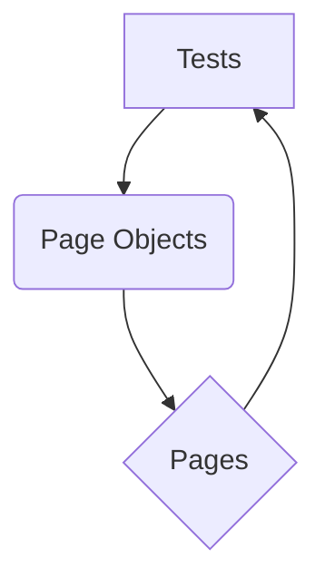

# Playwright MPC Tests

This project contains Playwright tests for the NAPLAN public demonstration site.

## Installation

1. **Clone the repository:**
   ```bash
   git clone https://github.com/gemini-cli-automation/playwright-mpc-tests.git
   ```

2. **Create a virtual environment:**
   ```bash
   python -m venv venv
   ```

3. **Activate the virtual environment:**
   - **Windows:**
     ```bash
     venv\Scripts\activate
     ```
   - **macOS/Linux:**
     ```bash
     source venv/bin/activate
     ```

4. **Install the dependencies:**
   ```bash
   pip install -r requirements.txt
   ```

## Running the tests

To run the tests, use the following command:

```bash
pytest
```

To run the tests in headed mode, use the following command:

```bash
pytest --headed
```

## Test Design

The tests are designed using the Page Object Model (POM) architecture. This architecture separates the test code from the page-specific code, making the tests more readable, maintainable, and reusable.

### Flow Diagram



### Explanation

- **Tests:** The tests are written in Python using the `pytest` framework and the `playwright` library. They are responsible for the test logic and assertions.
- **Page Objects:** Each page in the application has its own page object file. The page object contains the locators for the elements on the page and the methods to interact with them.
- **Pages:** The pages are the actual web pages of the application under test.

The tests use the page objects to interact with the pages and assert the expected behavior. This separation of concerns makes the tests more robust and easier to maintain.
